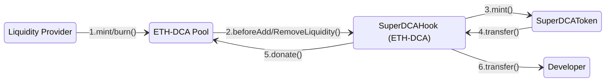

## Super DCA Token
### Super DCA uses Uniswap V4 Hooks for Token Distribution
The `SuperDCAHook` contract is a specialized Uniswap V4 pool hook designed to facilitate the distribution of `SuperDCAToken` tokens. It integrates with the Super DCA Protocol to ensure that tokens are minted and distributed efficiently during liquidity events. The primary functions of the `SuperDCAHook` are:
- **Before Liquidity Addition**: When liquidity is added to the pool, the hook resets the LP timelock, mints new `SuperDCAToken` tokens, donates half of the minted tokens to the pool, and transfers the remaining half to the developer.
- **Before Liquidity Removal**: If the LP timelock has expired, the same distribution process occurs before liquidity is removed from the pool.


1. The `Liquidity Provider` adds/removes liquidity to the `ETH‑DCA Pool`
2. The `ETH‑DCA Pool` calls the `SuperDCAHook` contract to distribute tokens to the `SuperDCAToken` contract.
3. The `SuperDCAToken` contract mints tokens and transfers them to the `SuperDCAHook` contract.
4. The `SuperDCAHook` contract donates tokens to the `ETH‑DCA Pool` and transfers the remaining tokens to the `Developer`.


#### Distribution Logic
The distribution logic of the `SuperDCAHook` is as follows:
- Calculate the amount of tokens to mint based on the elapsed time since the last minting event.
- Split the minted tokens into two halves:
  - **Community Share**: Donated to the pool.
  - **Developer Share**: Transferred to the developer's address.
- The hook ensures that the `SuperDCAToken` contract's `mint()` and `transfer()` functions are used for these operations.

### TODO: Reward Distribution
We need to track the amount of tokens staked for each token on the hook contract. This is used to determine the distribution of tokens to the various token pools on the hook contract.

This contract using a `rewardIndex` that is updated on each `beforeAddLiquidity` and `beforeRemoveLiquidity` hook. The `rewardIndex` is used to calculate the amount of tokens to distribute to the `SuperDCAToken` contract.

Users stake `SuperDCAToken` to one or more tokens on the hook contract. This is used to determine the distribution of tokens to the various token pools on the hook contract. The hook contract will only distribute tokens to pools that:

- Have one currency equal to the `SuperDCAToken` contract.
- Have a `500` pool fee set.

For each token we need to track the following:
- `stakedAmount` - The amount of `SuperDCAToken` that has been staked for the token.
- `lastRewardIndex` - The index of the last reward for the token.

At a global level we need to track the following:
- `totalStakedAmount` - The total amount of `SuperDCAToken` that has been staked across all tokens.
- `rewardIndex` - An accumulated index of rewards that is updated each time a reward is distributed. Begins at 1e18 and increments up based on the amount of tokens to mint normalized by the `totalStakedAmount`.

We use the following formula to calculate the amount of tokens to distribute to the token:
```solidity 
_updateRewardIndex(); // Update the index before calculating the reward amount
TokenRewardInfo tokenRewardInfo = tokenRewardInfos[token];
uint256 rewardAmount = (tokenRewardInfo.stakedAmount * (rewardIndex - tokenRewardInfo.lastRewardIndex)) / totalStakedAmount;
```
To calculate the rewardIndex, we take the amount of tokens to be minted based on the elapsed time since the last reward distribution, then we divide that by the total amount of `SuperDCAToken` that has been staked across all tokens (this is the `totalStakedAmount`). Then we add that to the `rewardIndex`.
```solidity
// Calculate the amount of tokens to mint based on the elapsed time since the last reward distribution
mintAmount = (currentTime - lastMintedTime) * mintRate;

// Add the normalized mintAmount to the rewardIndex
rewardIndex += (mintAmount * 1e18) / totalStakedAmount;
```

We need to do the following to implement this in SuperDCAHook:
- Add variables for tracking `totalStakedAmount`, `rewardIndex`
- Structure to track `token` information:
  - `stakedAmount`
  - `lastRewardIndex`
- Revise how we determine the amount of tokens to distribute in the `beforeAddLiquidity` and `beforeRemoveLiquidity` hooks.
- Add staking and unstaking methods to the `SuperDCAHook` contract. Before staking or unstaking, we need to update the rewardIndex to avoid being able to manipulate the rewardIndex by staking and unstaking.
- Add checks to the `beforeAddLiquidity` and `beforeRemoveLiquidity` hooks to validate the poolKey contains a pool fee of 500 and one of the currencies is the `SuperDCAToken` contract.

## Deployment Addresses

### Unichain Sepolia

| Contract | Address |
| --- | --- |
| `SuperDCAToken` | [0xFddB9180Dfa8c572A10ba939F901Abce15923Bc4](https://unichain-sepolia.blockscout.com/address/0xFddB9180Dfa8c572A10ba939F901Abce15923Bc4) |
| `SuperDCAHook` | [0x5cdcf75823620d1D93cf90BD4f768982fdecca00](https://unichain-sepolia.blockscout.com/address/0x5cdcf75823620d1D93cf90BD4f768982fdecca00) |

