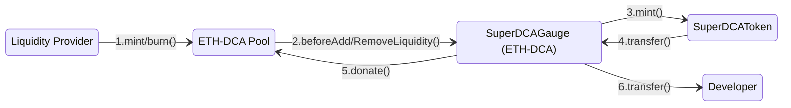

## Super DCA Token & Guage
### Super DCA uses Uniswap V4 Hooks for Token Distribution
The `SuperDCAGauge` contract is a specialized Uniswap V4 pool hook designed to facilitate the distribution of `SuperDCAToken` tokens. It integrates with the Super DCA Protocol to ensure that tokens are minted and distributed efficiently during liquidity events. The primary functions of the `SuperDCAGauge` are:
- **Before Liquidity Addition**: When liquidity is added to the pool, the hook resets the LP timelock, mints new `SuperDCAToken` tokens, donates half of the minted tokens to the pool, and transfers the remaining half to the developer.
- **Before Liquidity Removal**: If the LP timelock has expired, the same distribution process occurs before liquidity is removed from the pool.


1. The `Liquidity Provider` adds/removes liquidity to the `ETH‑DCA Pool`
2. The `ETH‑DCA Pool` calls the `SuperDCAGauge` contract to distribute tokens to the `SuperDCAToken` contract.
3. The `SuperDCAToken` contract mints tokens and transfers them to the `SuperDCAGauge` contract.
4. The `SuperDCAGauge` contract donates tokens to the `ETH‑DCA Pool` and transfers the remaining tokens to the `Developer`.

### Super DCA Gauge Distribution System

The `SuperDCAGauge` contract implements a gauge-style staking and reward distribution system for Uniswap V4 pools. When users add or remove liquidity from eligible pools (e.g., 0.05% fee tier pools containing DCA token), rewards are distributed to the members of the pool using Uniswap v4 `donate` functionality. 


DCA token holders `stake` their tokens in the `SuperDCAGauge` contract for a specific `token` pool (e.g., USDC, WETH). The magnitude of the stake amount relative to the total staked amount for all tokens determines the reward amount for each token's pool (e.g., USDC-DCA, WETH-DCA). The reward amount for each pool is calculated based on tracking an index that increases over time according to the mint rate:
```
reward = stakedAmount * (currentIndex - lastClaimIndex) / 1e18
```
where the reward index increases over time according to the mint rate. All rewards are split 50/50 between the pool (community) and developer. The `rewardIndex` in the contract closely mirrors the `incomeIndex`-method used by Aave for interest accrual. 

#### Example
In this example, we show how the `rewardIndex` is updated to accrue rewards for all pools. Consider two pools with 1000 total DCA staked:
```
USDC-DCA pool: 600 DCA staked (60%)
WETH-DCA pool: 400 DCA staked (40%)
Total Staked = 1000 DCA
```
Consider the emission rate of 100 DCA/s (in wei). After 20 seconds, 2000 DCA  rewards are generated. Which means that the community share is **1000 DCA**.
```
Reward Index = 1000000000000000000
Rewards = 1000 DCA
Total Staked = 1000 DCA
Reward per token = 1 DCA
Next Reward Index = 1000000000000000001 
```
This indicates all pools have been credited with 2 units of reward per token staked. And the math for recovering the current amount of rewards for each pool is as follows:
```
Rewards = stakedAmount * (currentIndex - lastClaimIndex)
USDC-DCA Rewards = 600 DCA * (1000000000000000001 - 1000000000000000000) = 600 DCA
WETH-DCA Rewards = 400 DCA * (1000000000000000001 - 1000000000000000000) = 400 DCA
```
When a pool triggers a reward distribution, the `rewardIndex` is updated to the current index and that pool's share of the rewards is minted and distributed to the pool and the developer.


## Deployment Addresses

### Unichain Sepolia

| Contract | Address |
| --- | --- |
| `SuperDCAToken` | [0xFddB9180Dfa8c572A10ba939F901Abce15923Bc4](https://unichain-sepolia.blockscout.com/address/0xFddB9180Dfa8c572A10ba939F901Abce15923Bc4) |
| `SuperDCAGauge` | [0x5cdcf75823620d1D93cf90BD4f768982fdecca00](https://unichain-sepolia.blockscout.com/address/0x5cdcf75823620d1D93cf90BD4f768982fdecca00) |

