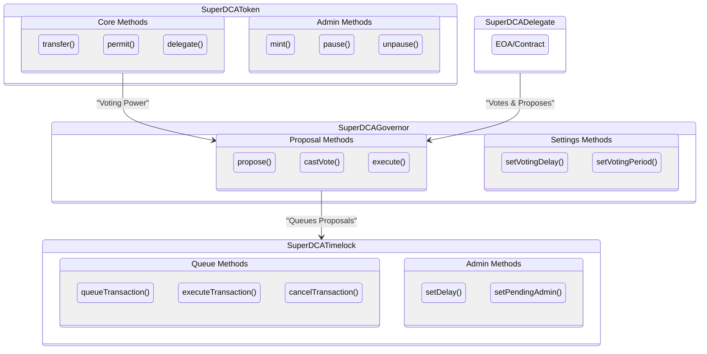
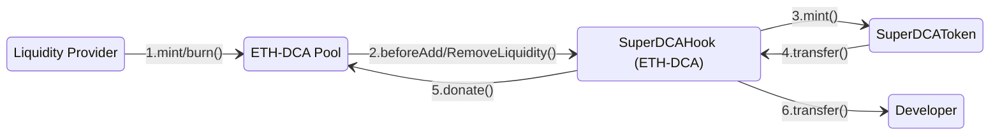

## Super DCA Token & Governance System

### Super DCA uses Compound‑Style Governance
This is the Super DCA Governance System. It is a Compound‑Style [`SuperDCAToken`](src/SuperDCAToken.sol), [`SuperDCATimelock`](src/SuperDCATimelock.sol), and [`SuperDCAGovernor`](src/SuperDCAGovernor.sol), which together help facilitate secure on-chain voting and decision making related to the Super DCA Protocol.
### Governance System Architecture Overview


#### Governance Components
The governance components of the Super DCA system are as follows:
- **SuperDCAToken**: Serves as the governance token, enabling holders to propose and vote on protocol changes.
- **SuperDCATimelock**: Acts as a delay mechanism for executing approved proposals, ensuring a buffer period for review and potential cancellation.
- **SuperDCAGovernor**: Manages the proposal lifecycle, including creation, voting, and execution of governance decisions.
- **Super DCA Delegates**: EOAs or contracts that can propose and vote on governance proposals because they have the required voting power.

### Super DCA uses Uniswap V4 Hooks for Token Distribution
The `SuperDCAHook` contract is a specialized Uniswap V4 pool hook designed to facilitate the distribution of `SuperDCAToken` tokens. It integrates with the Super DCA Protocol to ensure that tokens are minted and distributed efficiently during liquidity events. The primary functions of the `SuperDCAHook` are:
- **Before Liquidity Addition**: When liquidity is added to the pool, the hook resets the LP timelock, mints new `SuperDCAToken` tokens, donates half of the minted tokens to the pool, and transfers the remaining half to the developer.
- **Before Liquidity Removal**: If the LP timelock has expired, the same distribution process occurs before liquidity is removed from the pool.


1. The `Liquidity Provider` adds/removes liquidity to the `ETH‑DCA Pool`
2. The `ETH‑DCA Pool` calls the `SuperDCAHook` contract to distribute tokens to the `SuperDCAToken` contract.
3. The `SuperDCAToken` contract mints tokens and transfers them to the `SuperDCAHook` contract.
4. The `SuperDCAHook` contract donates tokens to the `ETH‑DCA Pool` and transfers the remaining tokens to the `Developer`.


#### Distribution Logic
The distribution logic of the `SuperDCAHook` is as follows:
- Calculate the amount of tokens to mint based on the elapsed time since the last minting event.
- Split the minted tokens into two halves:
  - **Community Share**: Donated to the pool.
  - **Developer Share**: Transferred to the developer's address.
- The hook ensures that the `SuperDCAToken` contract's `mint()` and `transfer()` functions are used for these operations.

## Deployment Addresses

### Unichain Sepolia

| Contract | Address |
| --- | --- |
| `SuperDCAToken` | [TBD](https://sepolia.arbiscan.io/address/TBD) |
| `SuperDCATimelock` | [TBD](https://sepolia.arbiscan.io/address/TBD) |
| `SuperDCAGovernor` | [TBD](https://sepolia.arbiscan.io/address/TBD) |
| `SuperDCAHook` | [TBD](https://sepolia.arbiscan.io/address/TBD) |

## Usage

### Build

```shell
$ forge build
```

### Test

```shell
$ forge test
```

### Format

```shell
$ forge fmt
```

### Gas Snapshots

```shell
$ forge snapshot
```

### Anvil

```shell
$ anvil
```

### Deploy

```shell
$ forge script script/Counter.s.sol:CounterScript --rpc-url <your_rpc_url> --private-key <your_private_key>
```

### Cast

```shell
$ cast <subcommand>
```

### Help

```shell
$ forge --help
$ anvil --help
$ cast --help
```
