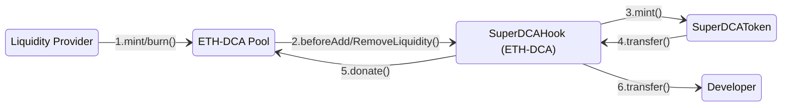

## Super DCA Token
### Super DCA uses Uniswap V4 Hooks for Token Distribution
The `SuperDCAHook` contract is a specialized Uniswap V4 pool hook designed to facilitate the distribution of `SuperDCAToken` tokens. It integrates with the Super DCA Protocol to ensure that tokens are minted and distributed efficiently during liquidity events. The primary functions of the `SuperDCAHook` are:
- **Before Liquidity Addition**: When liquidity is added to the pool, the hook resets the LP timelock, mints new `SuperDCAToken` tokens, donates half of the minted tokens to the pool, and transfers the remaining half to the developer.
- **Before Liquidity Removal**: If the LP timelock has expired, the same distribution process occurs before liquidity is removed from the pool.

1. The `Liquidity Provider` adds/removes liquidity to the `ETH‑DCA Pool`
2. The `ETH‑DCA Pool` calls the `SuperDCAHook` contract to distribute tokens to the `SuperDCAToken` contract.
3. The `SuperDCAToken` contract mints tokens and transfers them to the `SuperDCAHook` contract.
4. The `SuperDCAHook` contract donates tokens to the `ETH‑DCA Pool` and transfers the remaining tokens to the `Developer`.

#### Distribution Logic
The distribution logic of the `SuperDCAHook` is as follows:
- Calculate the amount of tokens to mint based on the elapsed time since the last minting event.
- Split the minted tokens into two halves:
  - **Community Share**: Donated to the pool.
  - **Developer Share**: Transferred to the developer's address.
- The hook ensures that the `SuperDCAToken` contract's `mint()` and `transfer()` functions are used for these operations.

## Deployment Addresses

### Unichain Sepolia

| Contract | Address |
| --- | --- |
| `SuperDCAToken` | [0xFddB9180Dfa8c572A10ba939F901Abce15923Bc4](https://unichain-sepolia.blockscout.com/address/0xFddB9180Dfa8c572A10ba939F901Abce15923Bc4) |
| `SuperDCAHook` | [0x5cdcf75823620d1D93cf90BD4f768982fdecca00](https://unichain-sepolia.blockscout.com/address/0x5cdcf75823620d1D93cf90BD4f768982fdecca00) |

