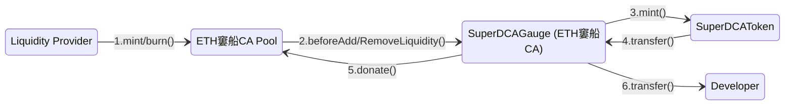

# Super DCA Gauge
A system for developers looking to do a fair distribution of an inflationary token that is split 50/50 between the community (i.e., Uniswap V4 Liquidity Providers) and the developers.


<div align="center">
Part of the Super DCA Framework
<br> 
<a href="https://github.com/Super-DCA-Tech/super-dca-token">🌐 Token</a> &nbsp;|&nbsp; <a href="https://github.com/Super-DCA-Tech/super-dca-gauge">📊 Gauge</a> &nbsp;|&nbsp; <a href="https://github.com/Super-DCA-Tech/super-dca-contracts">🏊 Pool</a>
</div>

## Super DCA Gauge Distribution System Specifications
The `SuperDCAGauge` contract is a specialized Uniswap V4 pool hook designed to implement a staking and reward distribution system for [`SuperDCAToken`](https://github.com/Super-DCA-Tech/super-dca-token) tokens. It integrates with Uniswap V4 pools to distribute rewards during liquidity events. The primary functions of the `SuperDCAGauge` are:

- **Before Initialize**: When a pool using the `SuperDCAGauge` hook is created, the hook:
  1. Reverts if the pool is not using the `SuperDCAToken` token or has a fee tier other than 0.05%

- **Before Liquidity Addition**: When liquidity is added to the pool, the hook:
  1. Updates the global reward index based on elapsed time and mint rate
  2. Calculates rewards for the pool based on staked amounts
  3. If rewards are available:
     - Splits rewards 50/50 between the pool (community) and developer
     - Donates the community share to the pool
     - Transfers the developer share to the developer address

- **Before Liquidity Removal**: The same distribution process occurs before liquidity is removed, following identical steps as the liquidity addition hook.

Key features:
- Only processes rewards for pools that include SuperDCAToken and have the correct fee (0.05%)
- Users can stake SuperDCATokens for specific token pools to participate in rewards
- Rewards for each pool are calculated based on staked amounts per pool, the total staked amount, the mint rate, and time elapsed

### Distribution

1. The `Liquidity Provider` adds/removes liquidity to the `ETH窶船CA Pool`
2. The `ETH窶船CA Pool` calls the `SuperDCAGauge` hook's beforeModifyLiquidity function
3. The `SuperDCAGauge` calculates rewards based on elapsed time and staked amounts
4. The [`SuperDCAToken`](https://github.com/Super-DCA-Tech/super-dca-token) mints new tokens to the `SuperDCAGauge` based on the mint rate

The `SuperDCAGauge` splits rewards 50/50 between:

   5. Pool (community share): Donated via Uniswap v4's donate function
   6. Developer: Transferred directly to developer address

### Staking
The `SuperDCAGauge` contract implements a gauge-style staking and reward distribution system for Uniswap V4 pools. When users add or remove liquidity from eligible pools (e.g., 0.05% fee tier pools containing DCA token), rewards are distributed to the members of the pool using Uniswap v4 `donate` functionality. 


DCA token holders `stake` their tokens in the `SuperDCAGauge` contract for a specific `token` pool (e.g., USDC, WETH). The magnitude of the stake amount relative to the total staked amount for all tokens determines the reward amount for each token's pool (e.g., USDC-DCA, WETH-DCA). The reward amount for each pool is calculated based on tracking an index that increases over time according to the mint rate. The following are the key formulas for the reward calculation:
```
# Minted Tokens
mintedTokens = mintRate * timeElapsed

# Reward Index
rewardIndex += mintedTokens / totalStaked

# Reward per token
reward = token.stakedAmount * (currentRewardIndex - token.lastRewardIndex)
```
where the reward index increases over time according to the mint rate. All rewards are split 50/50 between the pool (community) and developer. The `rewardIndex` in the contract closely mirrors the `incomeIndex`-method used by Aave for interest accrual. 

#### Example
In this example, we show how the `rewardIndex` is updated to accrue rewards for all pools. Consider two pools with 1000 total DCA staked:
```
USDC-DCA pool: 600 DCA staked (60%)
WETH-DCA pool: 400 DCA staked (40%)
Total Staked = 1000 DCA
```
Consider the emission rate of 100 DCA/s (in wei). After 20 seconds, _2000 DCA_  rewards are generated. Which means that the community share is **1000 DCA**.
```
Current Reward Index = 0 
Reward Amount    = 1000 DCA
Total Staked     = 1000 DCA
Reward per Token = Reward / Total Staked
                 = 1000 DCA / 1000 DCA
                 = 1 DCA
Next Reward Index += Rewards per Token
                  = 0 + 1 DCA
                  = 1 DCA
```
This indicates all pools have been credited with 1 units of reward _per token staked_ to the token's pool. And the math for recovering the current amount of rewards for each pool is as follows:
```
Pool Reward = stakedAmount * (currentIndex - lastClaimIndex)
USDC-DCA Reward = 600 DCA * (1 - 0) = 600 DCA
WETH-DCA Reward = 400 DCA * (1 - 0) = 400 DCA
```
When a pool triggers a reward distribution, the `rewardIndex` is updated to the current index and that pool's share of the rewards is minted and distributed to the pool and the developer. The other pools that did not trigger a reward distribution are not affected.

### Dynamic Fees
The `SuperDCAGauge` implements a dynamic fee system using Uniswap V4's dynamic fee capability, allowing for differentiated swap fees based on the trader's classification. This feature enables preferential fee treatment for internal ecosystem participants and keepers while maintaining standard fees for external users.

#### Fee Structure
- **Internal Fee**: 0% (0 basis points) - Applied to addresses marked as "internal"
- **Keeper Fee**: 0.10% (1000 basis points) - Applied to the current keeper address
- **External Fee**: 0.50% (5000 basis points) - Applied to all other addresses
- **Dynamic Application**: Fees are determined at swap time based on the swapper's classification

#### Fee Priority
The system prioritizes fee determination in the following order:
1. **Internal addresses** receive 0% fee (highest priority)
2. **Keeper address** receives 0.10% fee 
3. **All other addresses** receive 0.50% fee (lowest priority)

#### Keeper System
The keeper system implements a "king-of-the-hill" staking mechanism:
- **Single Keeper**: Only one address can be the keeper at any time
- **Deposit Requirement**: To become keeper, a user must deposit more DCA tokens than the current keeper
- **Automatic Refund**: The previous keeper's deposit is automatically returned when replaced
- **Fee Benefit**: The keeper receives reduced swap fees (0.10% vs 0.50% for external users)

##### Becoming a Keeper
Users can become the keeper by calling `becomeKeeper(uint256 amount)`:
- The amount must be greater than the current keeper's deposit
- The function transfers the deposit from the user and refunds the previous keeper
- A `KeeperChanged` event is emitted for transparency

#### Technical Implementation
The dynamic fee system operates through the `_beforeSwap` hook:

1. **Address Classification**: The system identifies the actual swapper using `IMsgSender(sender).msgSender()` to handle cases where swaps are routed through intermediary contracts
2. **Fee Selection**: Based on the swapper's classification, fees are applied in priority order:
   - Internal addresses: `internalFee` (0%)
   - Keeper address: `KEEPER_POOL_FEE` (0.10%)
   - All others: `externalFee` (0.50%)
3. **Dynamic Override**: The selected fee is returned with the `LPFeeLibrary.OVERRIDE_FEE_FLAG` to dynamically set the pool's fee for that specific swap

#### Management Functions
The fee system includes several management capabilities:

**Manager Role Functions** (restricted to `MANAGER_ROLE`):
- **`setFee(bool _isInternal, uint24 _newFee)`**: Updates either internal or external fee rates
- **`setInternalAddress(address _user, bool _isInternal)`**: Marks or unmarks addresses as internal for preferential fee treatment

**Public Functions**:
- **`becomeKeeper(uint256 amount)`**: Allows users to become the keeper by depositing more DCA tokens than the current keeper (king-of-the-hill mechanism)

## Deployment Addresses
| Network | Contract | Address |
| --- | --- | --- |
| All | Super DCA Token | 0xb1599cde32181f48f89683d3c5db5c5d2c7c93cc |
| Base | `SuperDCAGauge` | [0xBc5F29A583a8d3ec76e03372659e01a22feE3A80](https://basescan.org/address/0xBc5F29A583a8d3ec76e03372659e01a22feE3A80) |
| Optimism | `SuperDCAGauge` | [0xb4f4Ad63BCc0102B10e6227236e569Dce0d97A80](https://optimistic.etherscan.io/address/0xb4f4Ad63BCc0102B10e6227236e569Dce0d97A80) |
| Base Sepolia | `SuperDCAGauge` | [0x741810C3Fb97194dEcB045E45b9920680E1d7a80](https://sepolia.basescan.org/address/0x741810C3Fb97194dEcB045E45b9920680E1d7a80) |
| Unichain Sepolia | `SuperDCAGauge` | [0xEC67C9D1145aBb0FBBc791B657125718381DBa80](https://unichain-sepolia.blockscout.com/address/0xEC67C9D1145aBb0FBBc791B657125718381DBa80) |
